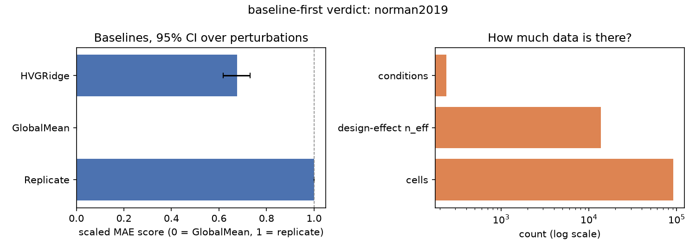

# baseline-first

> Run the dumb baseline before you train the big model.

Before you fine-tune a single-cell foundation model, `baseline-first` tells you
what a ten-line baseline scores on your data, and how much information your
data actually contains. On Norman 2019, **91,205 cells hold 237 distinct
perturbations: the cell count overstates the examples a perturbation model
learns from by 385x**, and a ridge regression already closes two thirds of
the gap between a trivial mean and a repeat of the experiment.

**Status: v0.1, active development.** Every number below comes from a command
in this repo; the command is given next to it.



## Quickstart

```bash
git clone https://github.com/Dar-kSun/baseline-first && cd baseline-first
python -m venv .venv && .venv/Scripts/activate   # .venv/bin/activate on macOS/Linux
pip install -e ".[dev]"
baseline-first card --dataset fixture      # 440-cell bundled fixture, seconds, offline
baseline-first card --dataset norman2019   # downloads ~170 MB (CC0), a few minutes
```

`card` writes `results/<dataset>/verdict.md` and `verdict.png`.
`baseline-first check-leakage data.h5ad --split-col split --key perturbation`
exits with an error if any perturbation appears in both train and test.

## What a verdict card says

1. **How much data there is:** cells, distinct conditions, and a design-effect
   effective sample size, with how much the cell count overstates each.
2. **What trivial baselines score**, under splits that hold out whole
   perturbations, with 95% CIs bootstrapped over perturbations (never cells):
   - `GlobalMean`: the same average profile for every perturbation (score 0).
   - `HVGRidge`: each target gene described by its co-expression with the top
     variable genes, then ridge regression.
   - `Replicate`: half of each perturbation's cells predicting the other half
     (score 1): the noise ceiling.
3. **The bar a bigger model must clear:** the upper end of the best baseline's
   95% CI, per metric.

Example: [`results/norman2019/verdict.md`](results/norman2019/verdict.md).

## Results

### Baselines and data size (Norman 2019, K562 CRISPRa, 5-fold CV over perturbations)

| method | MAE | Pearson delta | scaled MAE [95% CI] | scaled Pearson delta [95% CI] |
|---|---|---|---|---|
| GlobalMean | 0.0187 | 0.50 | 0 | 0 |
| HVGRidge | 0.0131 | 0.78 | **0.68** [0.62, 0.73] | **0.70** [0.64, 0.76] |
| Replicate (split-half) | 0.0104 | 0.89 | 1 | 1 |

| cells | distinct conditions | cells / condition | design-effect n_eff | cells / n_eff |
|---|---|---|---|---|
| 91,205 | 237 | **385x** | 13,678 | 6.7x |

Commands: `python scripts/01_run_baselines.py --dataset norman2019`,
`python scripts/02_effective_n_survey.py`. Details and the single-gene vs
pair breakdown: [`docs/findings.md`](docs/findings.md). Note that predicting one
profile for everything already reaches a Pearson delta of 0.50; a raw
correlation without a baseline means little.

### Predicting unseen genes in unseen cell types (the Virtual Cell Challenge setting)

On public CRISPRi screens (K562, RPE1, HepG2, Jurkat; 643,413 cells), holding
out a cell line **and** the perturbed genes at once
(`python scripts/13_unseen_gene_unseen_context.py`):

| | perturbation discrimination | expression error vs. predicting no change |
|---|---|---|
| a gene's own effect, measured in other cell types* (separate run, 53 genes) | 0.82 – 0.89 | 1.10 – 1.45x |
| co-expression ridge (no data on the gene's perturbation) | 0.52 – 0.54 | 0.89 – 1.15x |
| average response from other cell types | 0.50 | 0.90 – 1.11x |
| the held-out line's own average (the VCC "0", unreachable zero-shot) | 0.50 | 0.73 – 0.94x |

\* Only possible when the gene was perturbed elsewhere: true for 17 of the 300
VCC 2026 targets (`scripts/12_cross_context_transfer.py`; data coverage in
[`data/MANIFEST.md`](data/MANIFEST.md)).

Which genes a knockdown moves is substantially conserved across cell types,
but its size is not, and without data on the gene itself, co-expression gives
only a weak signal.

## Virtual Cell Challenge 2026

Registered for Arc Institute's 2026 Virtual Cell Challenge (validation round:
3 cell contexts x 300 CRISPRi targets; final test set 22 October, submissions
close 5 November 2026, dates confirmed on the official site). **No submission
has been made yet.** This section will state exactly what is entered, and its
score once known; it will not imply a placement.

## Limitations

- **Datasets.** Baseline results are on one CRISPRa dataset (Norman 2019,
  K562). Transfer results are on four CRISPRi cell lines' essential-gene
  screens and are computed on pseudobulks without the official metrics'
  finite-cell corrections.
- **Metrics.** MAE, RMSE, Pearson delta and the VCC perturbation
  discrimination score. The VCC's four differential-expression metrics are
  not reproduced locally yet.
- **Splits.** Perturbation-level splits allow a held-out single gene to appear
  inside a training pair; Norman pair scores depend strongly on whether their
  single-gene perturbations were seen (see `docs/findings.md`).
- **Effective sample size.** The design-effect estimate depends on a per-gene
  ICC summarised by its median, assumes a normal random-effects model, and is
  depressed by single-cell noise. See
  [`docs/effective-n-method.md`](docs/effective-n-method.md).
- **Scope of the claim.** A baseline matching or beating a foundation model on
  these tasks, metrics and splits does not mean foundation models are useless
  elsewhere; no foundation model has been run in this repo.

## Citations

- Elmarakeby H, Roman A, Johri S, Van Allen EM. Empirical evaluation of
  single-cell foundation models for predicting cancer outcomes. *bioRxiv*
  2025.10.31.685892 (2025). HVG baseline (4,096 genes) mean AUPRC ≈ 0.90 ±
  0.15 vs. scGPT [cancer] ≈ 0.89 ± 0.11.
- Turbine. [How did we get a regression model to the top of the Virtual Cell
  Challenge](https://turbine.ai/how-did-we-get-a-regression-model-to-the-top-of-the-virtual-cell-challenge/)
  (about 300 effective data points: one per condition).
- Arc Institute. [Virtual Cell Challenge 2025 wrap-up](https://arcinstitute.org/news/virtual-cell-challenge-2025-wrap-up);
  [the 2026 challenge](https://arcinstitute.org/news/virtual-cell-challenge-2026);
  scoring code and metric definitions: [cell-eval2](https://github.com/ArcInstitute/cell-eval2).
- Ahlmann-Eltze C, Huber W, Anders S. Deep-learning-based gene perturbation
  effect prediction does not yet outperform simple linear baselines.
  *Nature Methods* (2025).
- Norman TM et al. Exploring genetic interaction manifolds constructed from
  rich single-cell phenotypes. *Science* 365, 786–793 (2019).
- Replogle JM et al. Mapping information-rich genotype-phenotype landscapes
  with genome-scale Perturb-seq. *Cell* 185, 2559–2575 (2022).
- Nadig A et al. Transcriptome-wide analysis of differential expression in
  perturbation atlases. *Nature Genetics* (2025). doi:10.1038/s41588-025-02169-3.
- Roohani Y, Huang K, Leskovec J. Predicting transcriptional outcomes of novel
  multigene perturbations with GEARS. *Nature Biotechnology* (2024).
- Kish L. *Survey Sampling*. Wiley (1965).

## Licence

MIT. See [LICENSE](LICENSE). Data keep their own licences (see
`data/MANIFEST.md`); challenge data are not redistributed.
